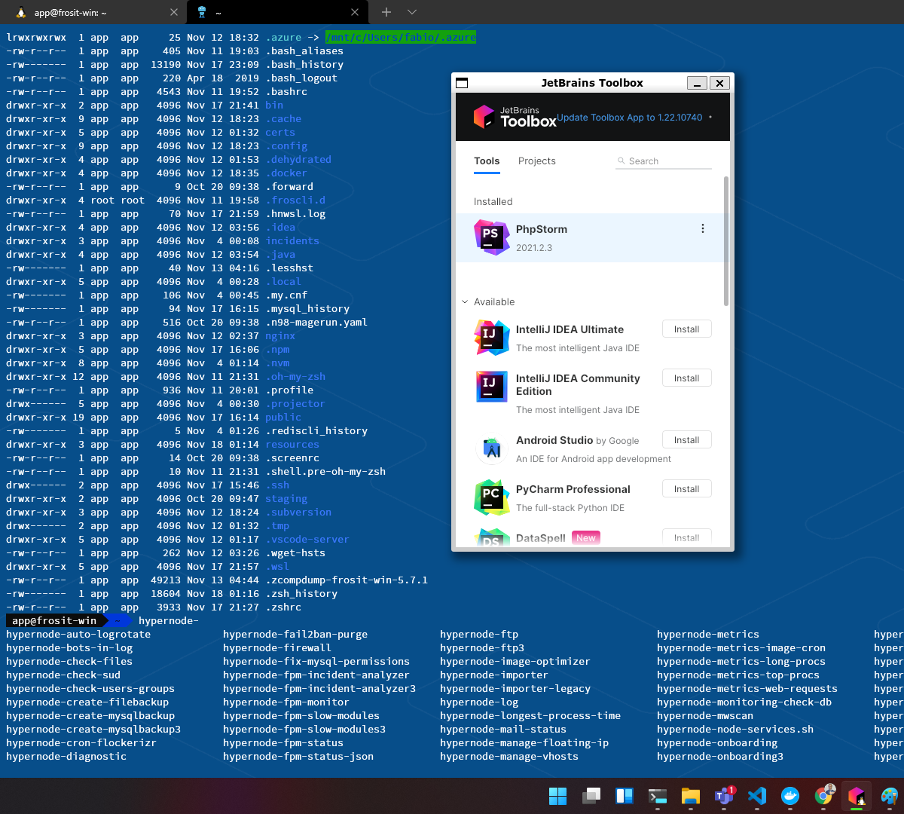
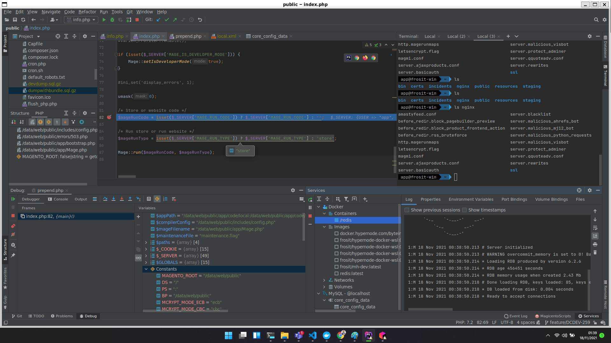
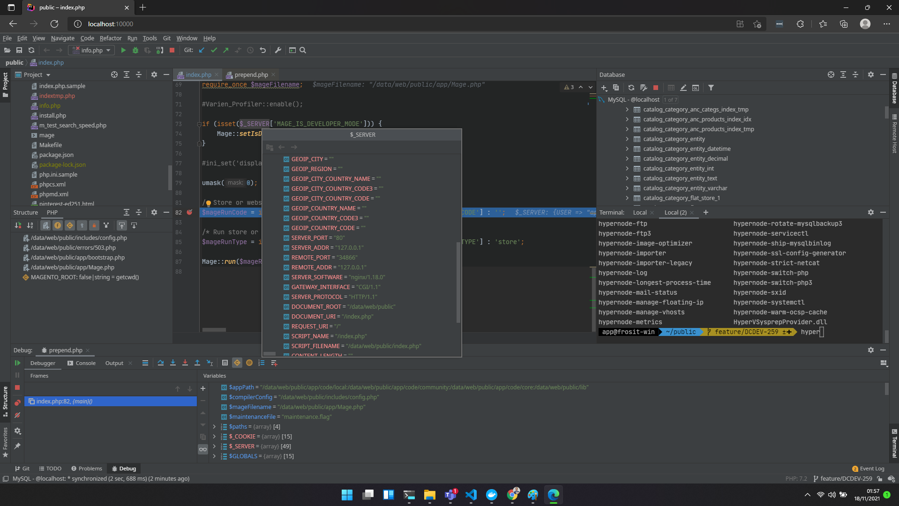

# Hypernode Docker WSL development environment

This repository contains a fully-featured Windows WSL development environment based on [hypernode-docker](https://github.com/ByteInternet/hypernode-docker) adjusted to support OS integration features that come with [WSL2 + WSLg](https://docs.microsoft.com/en-us/windows/wsl/) on Windows 11. This repository also integrates JetBrains IDE's using WSLg and projector to overcome filesystem performance issues.

# Features

* hypernode-docker as WSL2 environment
* Support for WSL OS interoperability
* Jetbrains Toolbox & JetBrains Projector pre-installed (overcoming disk performance)
  * Allows to run PhpStorm as linux app directly from the WSL/container environment
  * Allows to run PhpStorm as web app
* Adds a ZSH environment

# Prerequisites

* Windows 11
* [WSL2](https://docs.microsoft.com/en-us/windows/wsl/install)
* [WSLg](https://docs.microsoft.com/en-us/windows/wsl/tutorials/gui-apps#install-support-for-linux-gui-apps)
* [docker-desktop for windows](https://docs.docker.com/desktop/windows/install/)

You should have setup WSL/WSLg fully before you can use this repository. I recommend to follow the Microsoft guides above to install WSL/WSLg and a distro, for example ubuntu.
Your setup is ready when you are able to for example start `gedit` from the WSL environment.

__Warning__

The technologies used in this repository are fairly new and could be unstable. Also be aware of the security implications of using third-party WSL environments like this.

# Installation

The WSL environment is build from a slightly modified hypernode-docker container using the Dockerfile in this repository.

__1. Create the image__

First we have to create the image by pulling it or building it ourselves.

__Option: 1.a: pull the latest image__

```bash
docker pull frosit/hypernode-docker-wsl:latest
```

__Option: 1.b: build the image yourself__

```bash
# or make build-container
docker build -t frosit/hypernode-docker-wsl:latest .
```

__2. Create the container__

```bash
docker create --name hnwsl frosit/hypernode-docker-wsl:latest
```

__3. Export the container__

```bash
docker export hnwsl -o hnwsl.tar
```

__3. Import the container as WSL__

I prefer to store my WSL environments under `C:\WSL\<distro>`. So for example create a directory `C:\WSL\hypernode` and then import the tar you exported earlier. For example:

```powershell
wsl.exe --import hypernode C:\WSL\hypernode C:\WSL\hnwsl.tar
```

Restarting Windows terminal will automatically add the hypernode WSL to Windows terminal. You can use `wsl.exe -d hypernode` to enter the WSL environment.

## Optional: Docker integration

It is possible to use docker while in the WSL environment to add for example a different MySQL version. To do this go to the "docker desktop app" under settings > Resources > WSL Integration and check the WSL environment.
This will add a docker.sock within the WSL environment which is the same docker instance as your docker desktop.

# Usage

After import, there are a few things you can do.

> This image added sudo permissions to the app user and set the password to app. For root the password is root. You might want to change this: sudo passwd app

## Bringing up services

By default, the ports of the hypernode are mapped to ports on localhost and you have to start the services yourself.

```
sudo service nginx start
sudo service php7.2-fpm start
sudo service mysql.distrib start
sudo service redis-server start

# or
sudo /etc/my_init.d/60_restart_services.sh
```

Then you can find your instance on http://localhost.

## Switch PHP Version (@todo add)

> @todo add switch php scripts

## Starting an IDE using jetbrains-toolbox

Executing `jetbrains-toolbox` will bring up the toolbox dialogue from which you can install/start and IDE like PhpStorm. The first time could take a bit longer.

## Starting an IDE as cloud/web app using Projector

The `projector` command has options to manage projector IDE's. To install use `projector install`. Afterwards you can use `projector run <ide>` to start the IDE.

> note: projector is also new and slightly unstable. It should come on port 9999 of localhost

## Other features

Look for more features in the [docs folder](/docs) on subjects like:

* xDebug
* Using the Windows SSH agent
* Setting up Let's encrypt

# Issues

WSL2/WSLg has a few known issues. Information about these issues [can be found here](docs/known-issues.md)

# Preview

Here's my current and main development environment using the hypernode-docker as WSL environment. Including a themed Windows Terminal.



## Running PhpStorm from the hypernode environment using WSLg



## PhpStorm in Edge using projector server



## asciicast

[](https://asciinema.org/a/451194)
